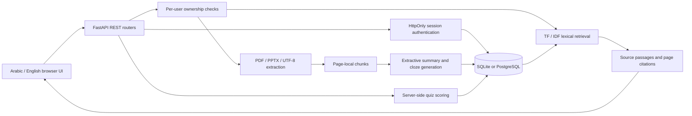

# Architecture and design decisions

## Boundaries

The browser and API are served from one origin. The frontend has no build step, external fonts, analytics or CDN dependencies. Routers manage HTTP and ownership; `services/study.py` handles deterministic document processing. SQLAlchemy sessions are request-scoped and closed after each request. SQLite is the convenient local default, with the same models supporting PostgreSQL.

## Data model

- **User**: normalized unique email, display name, salted scrypt hash.
- **LoginSession**: SHA-256 hash of a random opaque token, user ID, expiry.
- **GuestProfile**: temporary user with fixed 24-hour expiry and no usable login password.
- **Document**: owner, filename, upload timestamp and size, source chunks and generated study artifacts in JSON.
- **Quiz**: owner, document, immutable question snapshot, submitted answers and score. Unsubmitted drafts have a null score.
- **Review**: owner, document, card index, rating and timestamp.

Original file bytes are not retained after text processing. Source text is stored in the database. Deleting a document also deletes its quiz and review records in one transaction. The schema uses startup `create_all` for this first release; existing schema changes need a migration plan (e.g. Alembic) before future releases.

## Security choices

Passwords use per-password random salts and scrypt, checked with constant-time digest comparison. Sessions use random 32-byte tokens, stored as hashes and sent in HttpOnly, SameSite=Strict cookies. Expiry is enforced on every protected request. Logout removes the server-side session. Enable Secure cookies behind HTTPS.

Ownership is checked for every document/quiz access; another user's IDs return 404. No authentication secrets are returned to the UI. Quiz solutions are excluded until successful submission; this is a study tool, not a proctored examination environment. Atomic score assignment prevents repeat submissions. Uploaded filenames are not used to construct disk paths, and rendered strings are HTML-escaped.

Origin validation and strict cookies limit cross-site mutation requests. Login/register rate limiting is a small in-memory, per-IP demonstration, not a distributed protection system. Actual streamed body limits are enforced. Upload parsing now runs in a separate process with wall-clock and Unix CPU limits, and a Linux memory limit. A complete OS sandbox remains a deployment concern. A reverse proxy should enforce streaming request-body limits for public deployment.

## Retrieval and extensibility

The engine tokenizes Latin and Arabic text, removes a small stopword set, weights matches by term frequency and inverse document frequency, and returns original passages. Arabic tokenization is basic: there is no morphological analysis. No query relevance confidence or LLM factuality is implied.

A future local model provider can be added behind the study service: retrieve the same snippets, pass only those snippets to a locally hosted model, validate citations, and fall back to extractive passages on model failure. That extension is not required or bundled. Similarly, embeddings, OCR and background queues are explicit future enhancements, not hidden paid dependencies.

## Scaling trade-offs

JSON artifacts keep this demo easy to inspect and portable. For larger libraries, normalize chunks into a separate indexed table, use a shared queue for parsing, paginate lists, migrate schemas with Alembic, replace per-process throttling with shared storage, and add measured search relevance tests. This release intentionally targets small local coursework libraries.

Public previews use a separate database and loopback port, Secure cookies and exact-origin checks. See [sharing boundaries](SHARING.md) and [verification](BACKEND-VALIDATION.md).

Shared document operations live in `services/documents.py`; routers do not import other routers. Sample ingestion uses a single transaction with rollback on any sample failure.
