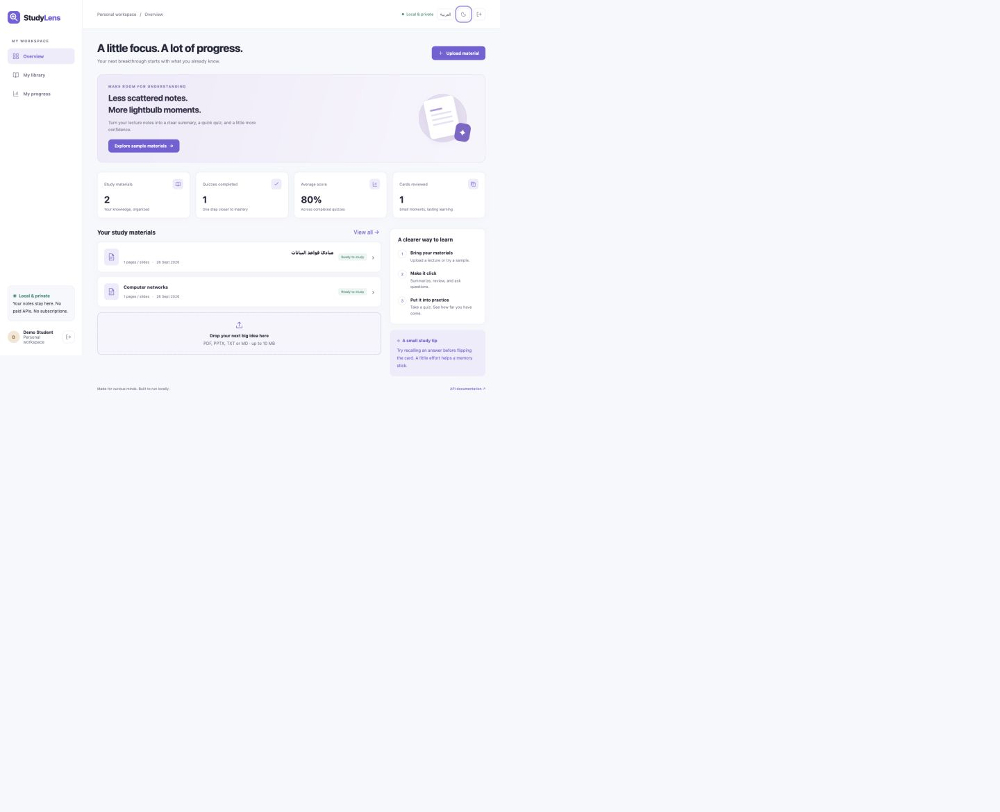
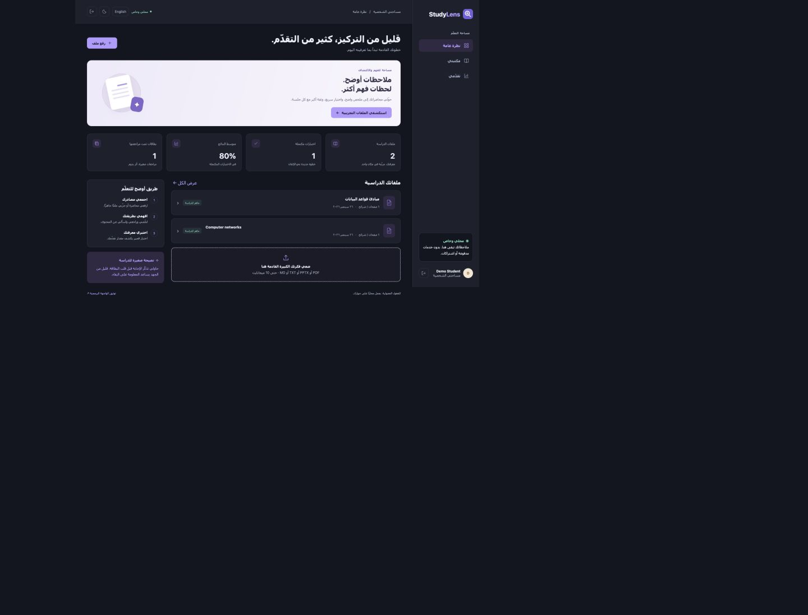
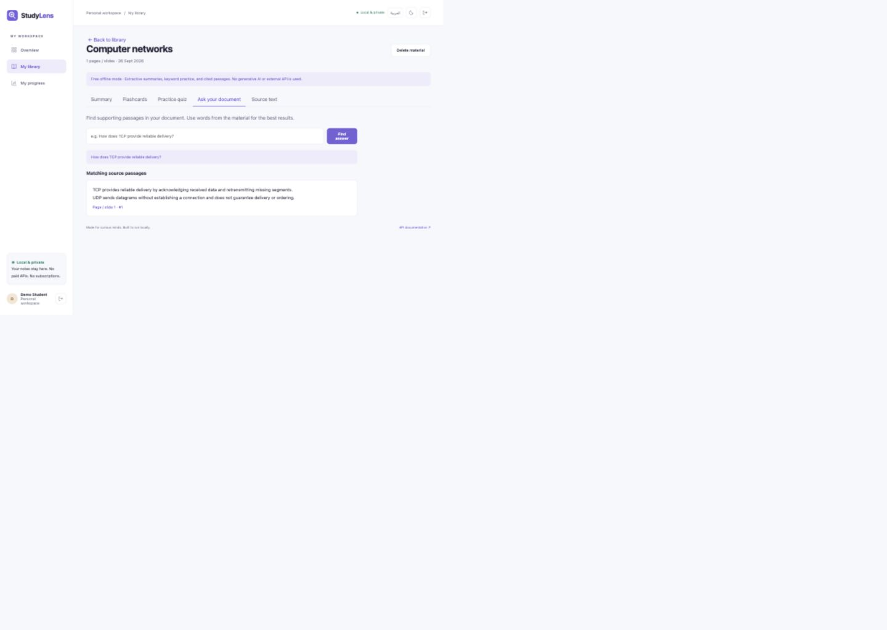
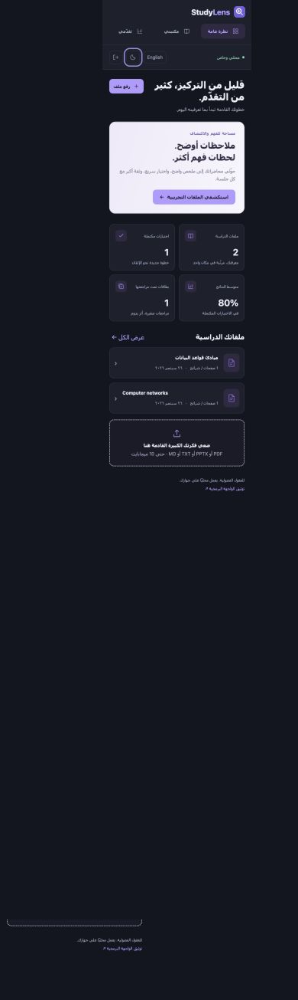
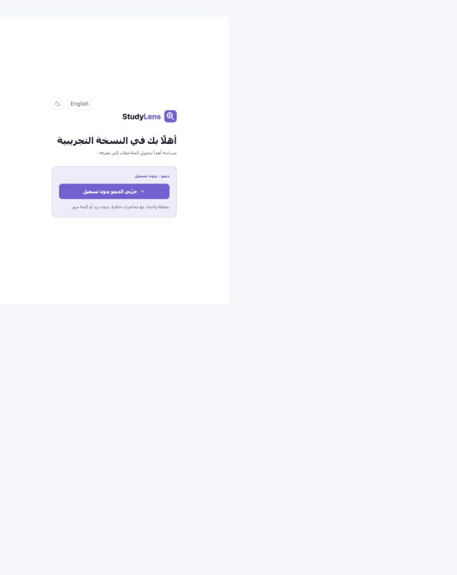

# Demo and portfolio guide

## A two-minute walkthrough

1. Start the server and select Try the demo — no sign-up. Samples load automatically.
2. Show the overview: materials, completed quizzes, average score, and card review count.
3. Open **Computer networks**, show the extractive summary and source page labels.
4. Flip a card and save a **Got it** review.
5. Complete a practice quiz. Submit and show the score plus the original source explanations.
6. Ask **How does TCP provide reliable delivery?** and point out the matching passage and citation.
7. Switch to Arabic, open **مبادئ قواعد البيانات**, and ask **المفتاح الأساسي**.
8. Toggle dark mode, reload the page, and show that the preference persists.
9. Open My progress, then `/docs` to show the backend API structure.

Do not present the offline engine as a generative LLM. Explain the benefit: the demo needs no paid service and returns inspectable source text. Mention the extension point for a future local model.

## Real screenshots

Captured from the running application with synthetic local demo data:

### English overview

### Arabic RTL and dark mode

### Source-backed question answering

### Mobile Arabic layout

## Verified during implementation

- Python 3.12, SQLite, macOS; automated suite: **8 passed**.
- Browser registration and persistent cookie session.
- Loading both sample documents, summary display and page citations.
- Flashcard flip and saved review event.
- Five-question quiz submission: intentionally answered one incorrectly; 80% was correctly displayed and saved.
- Document question with matching source passage.
- Arabic interface, RTL layout and dark mode persisted after reload.
- Desktop layout at 1440×1024 and mobile layout at 390×844; no horizontal overflow at the mobile viewport.
- JavaScript syntax checks and Python static checks passed.

PostgreSQL/Docker and Windows execution were not available for runtime verification. No external service or deployment was used. The dependency stack emits one non-failing Starlette deprecation warning about its test client's HTTPX integration.

## GitHub publishing checklist

- Upload the contents of the StudyLens folder, not its parent workspace.
- Keep `data/`, `.env`, `.venv`, caches and personal lecture files out of Git.
- Retain the MIT license and replace demo screenshots if you prefer a different presentation.
- Run `python -m pytest -q` before publishing changes.
- Suggested repository description: **Bilingual local-first study workspace built with FastAPI, SQLAlchemy and source-grounded document retrieval.**
- Add a short recording and repository URL to your portfolio. A paid host is not necessary to demonstrate the project.

## Updated no-signup entry

See the [updated backend report](BACKEND-VALIDATION.md) for 29 automated cases and 21 live HTTPS checks.
